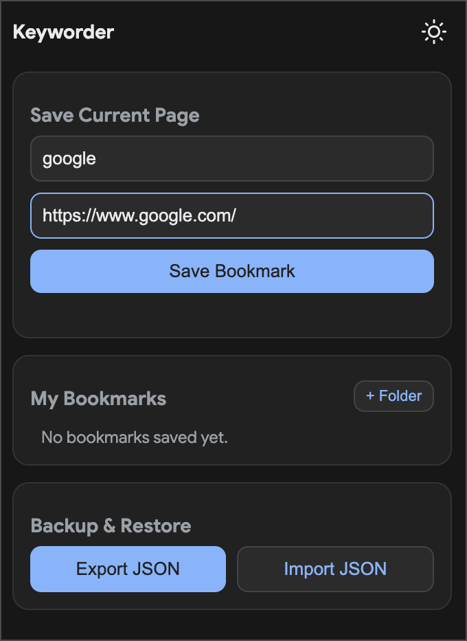
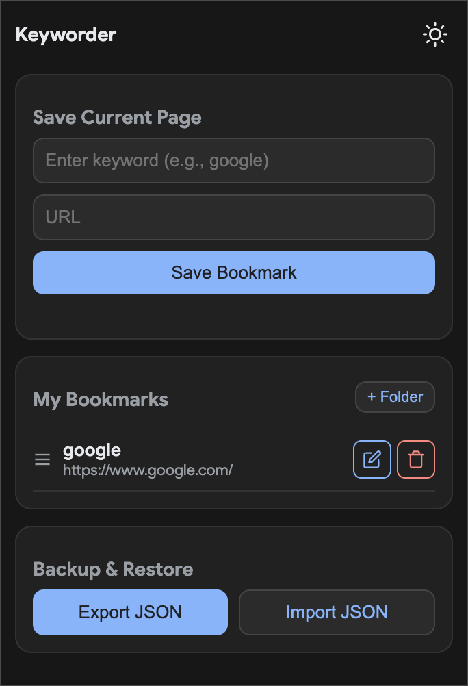
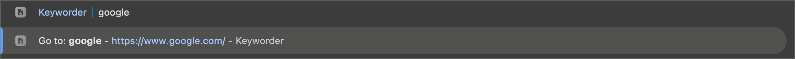

# Keyworder

A Chrome extension to assign a keyword to a URL and quickly access it via the Chrome omnibox (address bar).

## How it works

1. Click on the Keyworder extension icon in your toolbar.
2. The current URL will be pre-filled. Enter a short keyword you want to use for this URL.
3. Click "Save Bookmark".

To use a saved keyword:
1. Focus your Chrome address bar.
2. Type `k` and press `Space` or `Tab`.
3. Type your keyword (or part of it).
4. Press `Enter` to navigate directly to your saved URL.

## Example Usage

Let's say you frequently use Google Maps and want to access it quickly.

1. Open `https://maps.google.com` in your browser.
2. Click the Keyworder extension icon.
3. The URL field will be automatically filled with `https://maps.google.com`.
4. Enter `maps` in the keyword field and click "Save Bookmark".

Now, whenever you want to open Google Maps, simply:
1. Go to your address bar.
2. Type `k` + `Space` + `maps`.
3. Press `Enter` and you'll jump straight to Google Maps!

## Screenshots



---



---



## Building for Safari

The main difference with Safari is that Apple requires Web Extensions to be packaged inside a native macOS app container using Xcode.
Since the agent runtime environment lacks an accepted Xcode license, I couldn't run the build tool directly for you. However, I have created a script in the repository called build-safari.sh which automates the porting process using Apple's official safari-web-extension-converter CLI tool.

Here is how you can generate the Safari port locally on your Mac:

1. Accept Xcode License (if you haven't already): 
```shell sudo xcodebuild -license```
2. Run the Porting Script:
From your project root (or the directory where I placed it: /Users/reidar.veroft/Development/temp/Keyworder-safari), run the script:
`./build-safari.sh`
This script will generate an Xcode project (named Keyworder-SafariApp outside your repo folder) which bundles your extension into a Safari-compatible app without needing any changes to your JavaScript or Manifest!

Once generated:

1. Open the .xcodeproj file in Xcode.
2. Hit the "Play/Run" button (Cmd + R) to build the app.
3. Safari will launch. Go to Safari > Settings > Extensions and check the box to enable Keyworder.